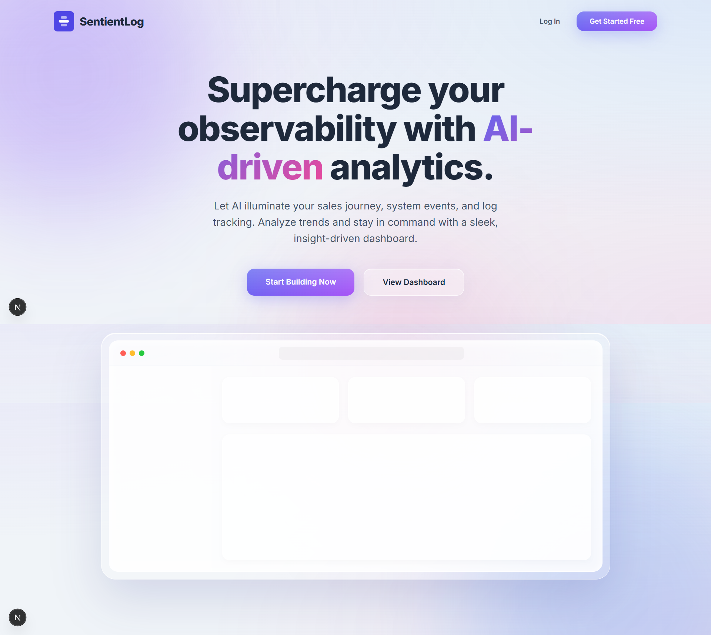
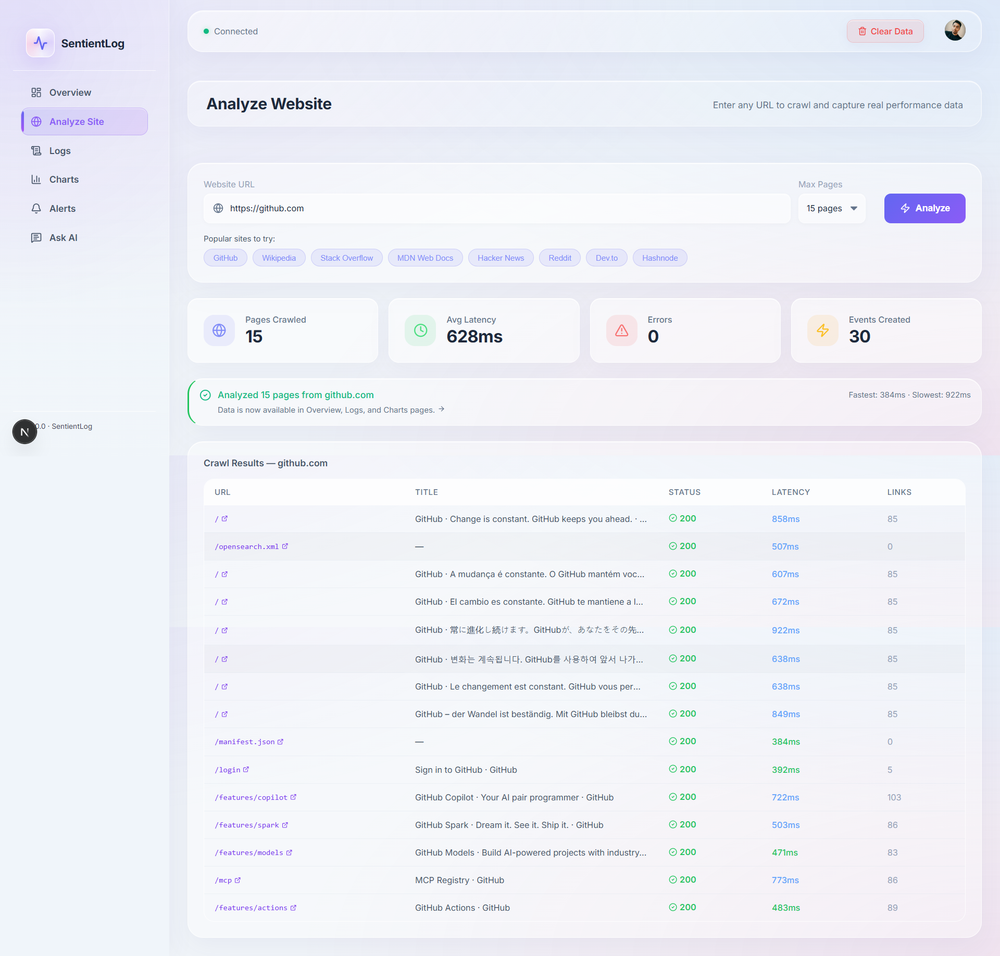
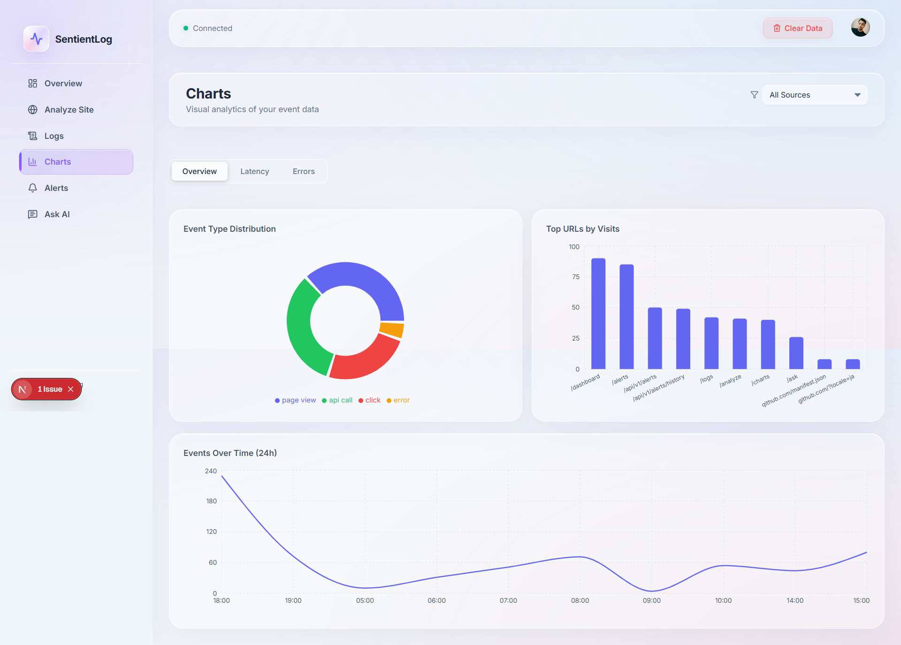
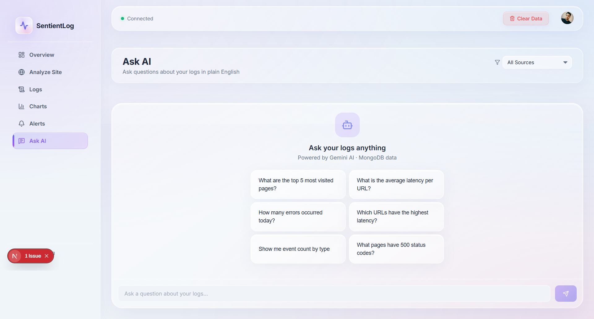

<div align="center">

# SentientLog

**AI-powered web observability & analytics platform**

[Live Demo](https://sentient-log-rho.vercel.app/) · [Report Bug](https://github.com/rharsh9162/sentient-log/issues) · [Request Feature](https://github.com/rharsh9162/sentient-log/issues)

<br/>


</div>

---

## Overview

SentientLog is a full-stack web observability and analytics platform. Drop a single `<script>` tag into **any** website and it instantly starts capturing page views, user clicks, and real API latency — with zero manual instrumentation. All data flows into an AI-powered dashboard where you can explore interactive charts, filter logs, set alert thresholds, and ask plain-English questions about your data via Google Gemini.

Think of it as a self-hosted, AI-native alternative to tools like Datadog or LogRocket — built entirely on the Next.js stack.

---

## Screenshots

| Landing | Analyze Site |
|---|---|
|  |  |

| Charts | Ask AI |
|---|---|
|  |  |

---

## Features

**Tracker SDK — One Script Tag, Full Visibility**

The core of SentientLog is a lightweight JavaScript SDK served from the platform itself. Add it to any site and real-time data starts flowing immediately — no build step, no npm install, no framework required.

```html
<!-- Works with any HTML site or MERN app -->
<script
  src="https://sentient-log-rho.vercel.app/tracker.js"
  data-site-id="YOUR_ACCOUNT_ID"
  defer>
</script>
```

For Next.js apps, use the Script component in your root `layout.jsx`:

```jsx
import Script from "next/script";

export default function RootLayout({ children }) {
  return (
    <html lang="en">
      <body>
        <Script
          src="https://sentient-log-rho.vercel.app/tracker.js"
          data-site-id="YOUR_ACCOUNT_ID"
          strategy="afterInteractive"
        />
        {children}
      </body>
    </html>
  );
}
```

Once installed, the tracker automatically:
- Captures **page views** on every navigation
- Records **button/link clicks** and user interactions
- Monkey-patches `fetch` and `axios` to track **API call latency** per endpoint — with zero code changes
- Reports **JavaScript errors** as they occur
- Sends all events to your SentientLog dashboard in real-time, scoped to your `data-site-id`

**Site Analyzer**
- Crawl any public URL on-demand — configurable max page depth
- Captures per-page HTTP status, latency, page title, and outbound link count
- Summary stats: pages crawled, average latency, error count, events created

**Dashboard & Charts**
- Event type distribution (page view, API call, click, error) — donut chart
- Top URLs by visit count — bar chart
- Events over time (24h) — line chart
- Tabbed views: Overview, Latency, Errors

**Logs & Alerts**
- Filterable, paginated log table across all tracked sources
- Configurable alert rules for latency thresholds and error rates
- Instant email notifications via Resend when thresholds are breached

**Ask AI**
- Chat interface to query your log data in plain English
- Powered by Google Gemini AI running against your live MongoDB data
- Suggested prompts: top visited pages, average latency per URL, error counts, high-latency endpoints

**Auth & Infrastructure**
- Secure authentication via Clerk (email, social, phone)
- Background job scheduling with Inngest
- Transactional email notifications via Resend

---

## Tech Stack

| | Technology |
|---|---|
| Framework | Next.js (App Router) |
| Frontend | React, Tailwind CSS v4, Framer Motion |
| Charts | Recharts |
| Backend | Next.js API Routes |
| Database | MongoDB (Mongoose) |
| Auth | Clerk |
| AI | Google Gemini (`@google/generative-ai`) |
| Background Jobs | Inngest |
| Email | Resend |
| HTTP Client | Axios |
| Deployment | Vercel |

---

## Project Structure

```
sentient-log/
├── public/               # Static assets
└── src/
    ├── app/              # Next.js App Router
    │   ├── (auth)/       # Auth pages (Clerk)
    │   ├── dashboard/    # Protected dashboard layout
    │   │   ├── overview/
    │   │   ├── analyze/
    │   │   ├── logs/
    │   │   ├── charts/
    │   │   ├── alerts/
    │   │   └── ask/      # AI chat interface
    │   └── api/          # API routes
    │       ├── crawl/    # Website crawling logic
    │       ├── events/   # Event ingestion & querying
    │       ├── alerts/   # Alert management
    │       ├── ask-ai/   # Gemini AI endpoint
    │       └── inngest/  # Background job handlers
    ├── components/       # Reusable UI components
    ├── lib/              # DB connection, utilities
    └── models/           # Mongoose schemas
```

---

## Getting Started

### Prerequisites

- Node.js v18+
- MongoDB (local or Atlas)
- Accounts on: [Clerk](https://clerk.com), [Google AI Studio](https://aistudio.google.com), [Inngest](https://www.inngest.com), [Resend](https://resend.com)

### Installation

```bash
git clone https://github.com/rharsh9162/sentient-log.git
cd sentient-log
npm install
```

### Environment Variables

Create a `.env.local` file in the root directory:

```env
# Database
MONGODB_URI=your_mongodb_connection_string

# Clerk Authentication
NEXT_PUBLIC_CLERK_PUBLISHABLE_KEY=your_clerk_publishable_key
CLERK_SECRET_KEY=your_clerk_secret_key
NEXT_PUBLIC_CLERK_SIGN_IN_URL=/sign-in
NEXT_PUBLIC_CLERK_SIGN_UP_URL=/sign-up

# Google Gemini AI
GEMINI_API_KEY=your_gemini_api_key

# Inngest
INNGEST_EVENT_KEY=your_inngest_event_key
INNGEST_SIGNING_KEY=your_inngest_signing_key

# Resend (Email)
RESEND_API_KEY=your_resend_api_key
```

### Running Locally

```bash
npm run dev
```

Open [http://localhost:3000](http://localhost:3000) in your browser.

---

## Deployment

SentientLog is deployed on [Vercel](https://vercel.com). Add all environment variables to your Vercel project settings before deploying.

```bash
vercel --prod
```

---

## License

This project is for educational and portfolio purposes.

---

<div align="center">
Made by <a href="https://github.com/rharsh9162">rharsh9162</a>
</div>
