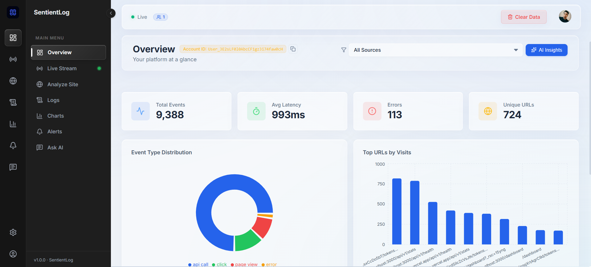
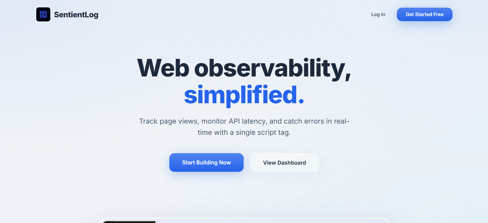
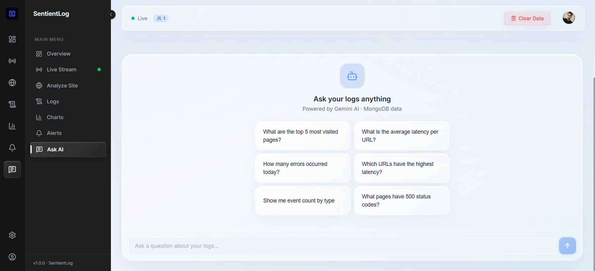
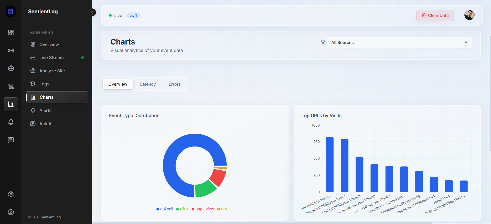
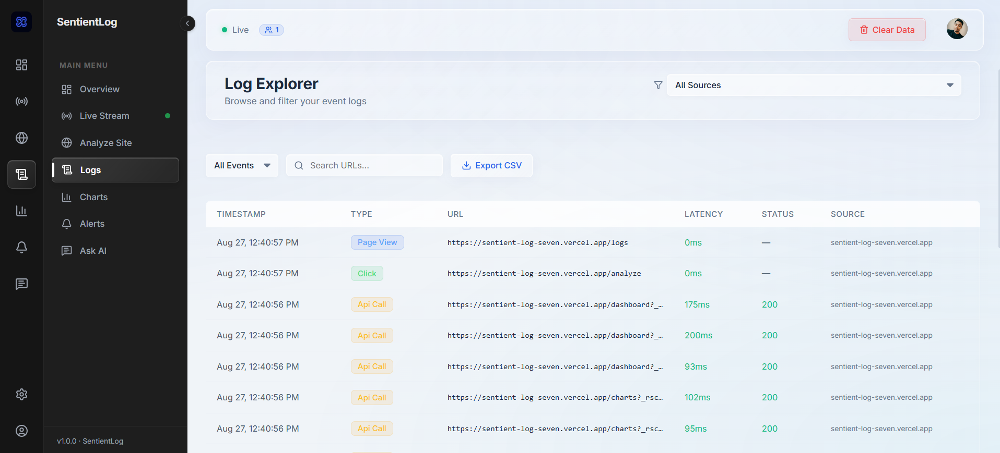
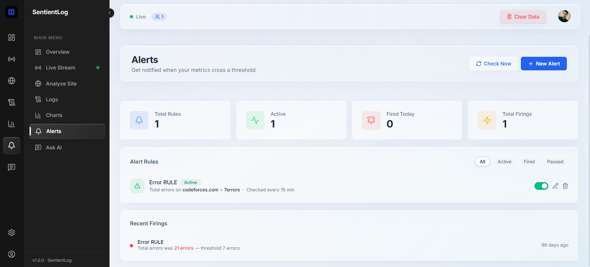
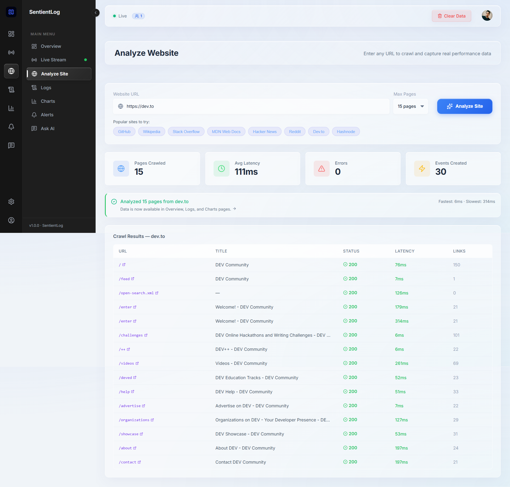
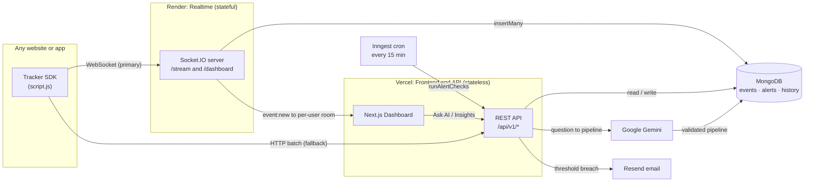

<div align="center">


# SentientLog

### AI-native web observability — drop in one script tag, watch your site think out loud.

**SentientLog** turns raw website traffic into real-time, AI-readable insight. Add a single `<script>` to any site and it instantly streams page views, clicks, API latency, and errors into a live dashboard — then lets you *ask questions of your data in plain English*.

<br/>

[**Live Demo**](https://sentient-log-seven.vercel.app) &nbsp;·&nbsp; [Report a Bug](https://github.com/rharsh9162/sentient-log/issues) &nbsp;·&nbsp; [Request a Feature](https://github.com/rharsh9162/sentient-log/issues)

<br/>


</div>

<br/>

<div align="center">
  
  <p><em>Real-time analytics dashboard — live event stream, KPIs, and AI-generated insights.</em></p>
</div>

---

## Table of Contents

- [Overview](#overview)
- [The Problem](#the-problem)
- [Features](#features)
- [Screenshots](#screenshots)
- [Architecture](#architecture)
- [Tech Stack](#tech-stack)
- [Engineering Highlights](#engineering-highlights)
- [Getting Started](#getting-started)
- [Integrating the Tracker](#integrating-the-tracker)
- [Project Structure](#project-structure)
- [Deployment](#deployment)
- [Roadmap](#roadmap)
- [Author](#author)

---

## Overview

SentientLog is a **full-stack, AI-native observability and web-analytics platform**. It combines three things most teams stitch together from separate tools — **product analytics**, **error & performance monitoring**, and **alerting** — into one dashboard, and adds a conversational AI layer on top.

The core idea is *zero-instrumentation*: you don't wrap functions, import an SDK, or add a build step. You drop one script tag onto any website — vanilla HTML, MERN, Next.js, anything — and telemetry starts flowing in real time over WebSockets. From there you can explore interactive charts, filter a live log stream, set threshold-based email alerts, crawl and audit a site on demand, and **ask plain-English questions** that Google Gemini answers by querying your live data directly.

> Think of it as a self-hostable, AI-first alternative to Datadog / LogRocket, built end-to-end on the modern Next.js stack.

---

## The Problem

Production visibility is usually painful for small teams and solo builders:

| Pain | What it looks like | How SentientLog answers it |
|---|---|---|
| **Too many logs, too little signal** | Finding the root cause of an error feels like finding a needle in a haystack. | Ask *"why were there so many errors today?"* and get an AI summary grounded in your real data. |
| **You find out last** | You learn about a crash or a slow API when customers complain on social media. | Threshold alerts fire the moment latency or error-rate crosses your limit — straight to your inbox. |
| **Fragmented tooling** | Context-switching between analytics, error tracking, and uptime monitors wastes time. | Traffic, performance, errors, and alerts live on one real-time dashboard. |

---

## Features

**Drop-in Tracker SDK — one script tag, full visibility**
A lightweight vanilla-JS tracker (`public/script.js`) served by the platform itself. Once added, it automatically captures **page views** (SPA-aware, via `history.pushState`/`popstate` patching), **clicks** on interactive elements, **API latency** by monkey-patching the browser's `fetch`, and **JavaScript errors** + unhandled promise rejections — enriching every event with device, browser, referrer source, and UTM data. No build step, no npm install, no framework required.

**Real-time streaming with graceful degradation**
Events travel over a **Socket.IO** connection first; if WebSockets are unavailable the tracker transparently falls back to **batched HTTP** (20 events / 2s), and buffers to an **offline queue** while disconnected — so nothing is lost. A live *Stream* page and live *visitor* counts update instantly.

**Ask AI — natural language to MongoDB**
A chat interface where you ask questions like *"top 5 slowest pages in the last 24 hours"*. The `AnalyticAgent` uses **Gemini 2.5 Flash** to translate your question into a MongoDB aggregation pipeline, executes it against your live data, and returns results plus a one-line summary.

**Automated AI Insights**
The dashboard generates five concise, actionable insights each day — traffic shifts, error spikes, top pages — by comparing the last 24 hours against the previous window and summarizing with Gemini.

**Threshold-based alerting**
Define rules on **average latency**, **error rate**, **slow pages**, or **total errors**, over windows from 15 minutes to monthly. An **Inngest** cron evaluates them every 15 minutes; breaches are recorded to history and emailed via **Resend**.

**On-demand Site Analyzer**
Crawl any public URL (same-origin, configurable depth) and capture per-page HTTP status, latency, title, byte size, and outbound link count — with retries and exponential backoff.

**Dashboard & charts**
KPI cards, event-type distribution, top URLs, and events-over-time, split across **Overview / Latency / Errors** tabs (Recharts).

**Auth & multi-tenancy**
**Clerk** handles authentication; every event, query, and alert is scoped to a `user_id`, and dashboards subscribe to a private per-user real-time room.

---

## Screenshots

| Landing | Dashboard |
|:---:|:---:|
|  |  |

| Ask AI | Charts |
|:---:|:---:|
|  |  |

| Logs | Alerts |
|:---:|:---:|
|  |  |

| Site Analyzer | |
|:---:|:---:|
|  | |

---

## Architecture

SentientLog runs a **decoupled topology** that matches each workload to the right platform: a **stateless** Next.js frontend + REST API on **Vercel**, and a **stateful** Socket.IO server on **Render** (persistent WebSocket connections can't live on Vercel's serverless functions). Both share one MongoDB.


```mermaid
flowchart LR
    subgraph Client["Any website or app"]
        SDK["Tracker SDK<br/>(script.js)"]
    end

    subgraph Vercel["Vercel: Frontend and API (stateless)"]
        UI["Next.js Dashboard"]
        API["REST API<br/>/api/v1/*"]
    end

    subgraph Render["Render: Realtime (stateful)"]
        WS["Socket.IO server<br/>/stream and /dashboard"]
    end

    DB[("MongoDB<br/>events · alerts · history")]
    Gemini["Google Gemini"]
    Cron["Inngest cron<br/>every 15 min"]
    Mail["Resend email"]

    SDK -- "WebSocket (primary)" --> WS
    SDK -- "HTTP batch (fallback)" --> API
    WS -- "insertMany" --> DB
    API -- "read / write" --> DB
    WS -- "event:new to per-user room" --> UI
    UI -- "Ask AI / Insights" --> API
    API -- "question to pipeline" --> Gemini
    Gemini -- "validated pipeline" --> DB
    Cron -- "runAlertChecks" --> API
    API -- "threshold breach" --> Mail
```

**Real-time event flow:** the tracker emits to the `/stream` namespace → the server tags each event with its owner and bulk-inserts to MongoDB → it broadcasts `event:new` into the owner's `/dashboard` room → the dashboard updates live. Visitor-stats broadcasts are **debounced (2s)** so a burst of events never floods connected clients.

---

## Tech Stack

| Layer | Technology |
|---|---|
| **Framework** | Next.js 16 (App Router) on a custom Node HTTP server |
| **Frontend** | React 18, Tailwind CSS 3, Recharts, lucide-react |
| **API** | Next.js Route Handlers (`/api/v1/*`) behind a shared auth/error handler |
| **Real-time** | Socket.IO 4 (`/stream` ingest + `/dashboard` push namespaces) |
| **Database** | MongoDB + Mongoose 9 (indexed, multi-tenant) |
| **AI** | Google Gemini 2.5 Flash (`@google/generative-ai`) |
| **Auth** | Clerk |
| **Background jobs** | Inngest (15-minute alert cron) |
| **Email** | Resend |
| **HTTP client** | Axios |
| **Deployment** | Vercel (frontend + API) · Render (WebSocket server) |

---

## Engineering Highlights

A few decisions worth calling out for reviewers:

- **Safe AI querying.** Gemini output is never trusted blindly. Every generated pipeline passes an **operator allowlist** (blocking `$out`, `$merge`, `$function`, etc.) and a **forced `$match` on `user_id`** is injected as the first stage — so an AI-authored query can neither mutate data nor read across tenants.
- **Real-time with no dropped events.** WebSocket-first delivery, automatic **HTTP batching fallback**, and a client-side **offline queue** mean telemetry survives flaky networks, blocked sockets, and page unloads (`keepalive` + `visibilitychange` flush).
- **Platform-aware decoupling.** Stateless work (UI, REST, AI) runs on Vercel; the stateful Socket.IO server runs on Render. The tracker and dashboard discover the WebSocket origin via `data-socket` / `NEXT_PUBLIC_SOCKET_URL`, so the two halves deploy independently.
- **Multi-tenant by construction.** Events carry an indexed `user_id`; dashboards join a private Socket.IO room keyed by user; API routes resolve identity from Clerk before touching data.
- **Throughput-minded.** Bulk `insertMany` (`ordered: false`), debounced stat broadcasts, indexes on `user_id`, `timestamp`, `url`, and `event_type`, and client-side batching keep both the tracked site and the server light.
- **DRY, consistent API layer.** A `withApiHandler` higher-order function centralizes DB connection, Clerk auth, and standardized error handling across every route.

---

## Getting Started

### Prerequisites

- **Node.js 18+**
- **MongoDB** (local or Atlas)
- Free accounts for: [Clerk](https://clerk.com), [Google AI Studio](https://aistudio.google.com), [Resend](https://resend.com), and optionally [Inngest](https://www.inngest.com)

### Installation

```bash
git clone https://github.com/rharsh9162/sentient-log.git
cd sentient-log
npm install
```

### Environment variables

Create a `.env.local` in the project root:

```env
# Database
MONGODB_URI=your_mongodb_connection_string

# Clerk Authentication
NEXT_PUBLIC_CLERK_PUBLISHABLE_KEY=your_clerk_publishable_key
CLERK_SECRET_KEY=your_clerk_secret_key
NEXT_PUBLIC_CLERK_SIGN_IN_URL=/login
NEXT_PUBLIC_CLERK_SIGN_UP_URL=/register
NEXT_PUBLIC_CLERK_AFTER_SIGN_IN_URL=/dashboard
NEXT_PUBLIC_CLERK_AFTER_SIGN_UP_URL=/dashboard

# Google Gemini
GEMINI_API_KEY=your_gemini_api_key

# Resend (alert emails)
RESEND_API_KEY=your_resend_api_key

# Real-time backend origin (used by the frontend/tracker to reach the Socket.IO server)
NEXT_PUBLIC_SOCKET_URL=http://localhost:3000
```

<details>
<summary><strong>Production-only variables</strong></summary>

<br/>

When registering background functions with Inngest Cloud, also set:

```env
INNGEST_EVENT_KEY=your_inngest_event_key
INNGEST_SIGNING_KEY=your_inngest_signing_key
```

For local development you can instead run the Inngest dev server: `npx inngest-cli@latest dev`.

</details>

### Run locally

```bash
npm run dev
```

This starts the custom server (`server.js`) — Next.js **and** the Socket.IO server together — at [http://localhost:3000](http://localhost:3000).

---

## Integrating the Tracker

Sign in, grab your **account ID** from the dashboard, and add the snippet to any site you want to monitor.

**Standard HTML / MERN apps** — paste inside `<head>`:

```html
<!-- SentientLog Analytics Tracker -->
<script
  src="https://sentient-log-seven.vercel.app/script.js"
  data-site-id="YOUR_ACCOUNT_ID"
  data-socket="https://sentient-log-yvg1.onrender.com"
  defer
></script>
```

**Next.js apps** — use the `Script` component in your root `layout.jsx`:

```jsx
import Script from "next/script";

export default function RootLayout({ children }) {
  return (
    <html lang="en">
      <body>
        <Script
          src="https://sentient-log-seven.vercel.app/script.js"
          data-site-id="YOUR_ACCOUNT_ID"
          data-socket="https://sentient-log-yvg1.onrender.com"
          strategy="afterInteractive"
        />
        {children}
      </body>
    </html>
  );
}
```

Telemetry begins streaming to your dashboard immediately, scoped to your `data-site-id`.

---

## Project Structure

<details>
<summary><strong>Expand file tree</strong></summary>

```
sentient-log/
├── public/
│   ├── script.js              # Drop-in tracker SDK (v2) — WebSocket + HTTP fallback
│   ├── logo.png
│   └── screenshots/
├── server.js                  # Custom server: Next.js + Socket.IO (/stream, /dashboard)
├── src/
│   ├── app/
│   │   ├── (marketing)/       # Public landing page
│   │   ├── (dashboard)/       # Auth-gated: dashboard, logs, charts, analyze, ask, alerts, stream
│   │   ├── login/  register/  # Clerk auth pages
│   │   └── api/
│   │       ├── v1/            # REST: ingest, logs, query, stats, analyze,
│   │       │                  #       alerts (+check, +history), ai/insights, clear, health
│   │       └── inngest/       # Inngest function registration
│   ├── components/            # Feature-grouped UI (dashboard, charts, alerts, analyze, layout, …)
│   ├── inngest/               # Background-job client + functions (alert cron)
│   ├── lib/                   # db, api-handler (auth/error HOC), getUser
│   ├── models/                # Mongoose schemas: Event, Alert, AlertHistory
│   ├── services/              # AnalyticAgent (AI), AlertChecker, CrawlerService, AlertEmailService
│   ├── templates/             # Transactional email templates
│   └── middleware.js          # Clerk route protection
└── package.json
```

</details>

---

## Deployment

SentientLog deploys as **two coordinated services**:

1. **Frontend + API → Vercel.** Standard Next.js deployment. Set every environment variable above, and point `NEXT_PUBLIC_SOCKET_URL` at your Render service URL.
2. **WebSocket server → Render.** A Node Web Service running `npm run start` (`node server.js`), which hosts the Socket.IO `/stream` and `/dashboard` namespaces. It needs `MONGODB_URI` (and shares the same database as Vercel).

```bash
npm run build && npm run start
```

Because the tracker takes its real-time origin from `data-socket`, the two services scale and redeploy independently.

---

## Roadmap

- [ ] Session replay / user-journey timelines
- [ ] Configurable dashboards and saved AI queries
- [ ] Anomaly detection on latency & error-rate trends
- [ ] Slack / webhook alert channels alongside email
- [ ] Team workspaces with role-based access

---

## Author

**Harsh** &nbsp;·&nbsp; Full-Stack Developer

- GitHub — [@rharsh9162](https://github.com/rharsh9162)
- LinkedIn — [linkedin.com/in/rharsh9162](https://www.linkedin.com/in/rharsh9162/)
- Email — [rharsh.9162@gmail.com](mailto:rharsh.9162@gmail.com)

If you're a recruiter or engineer taking a look — thanks for reading. I'm happy to walk through any part of the architecture or the design decisions behind it.

---

<div align="center">

*Released for educational and portfolio purposes.*

**Built with Next.js, Socket.IO, MongoDB, and Google Gemini**

</div>
